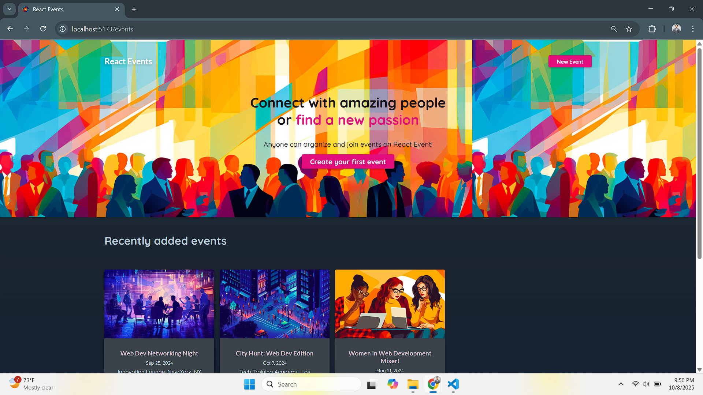
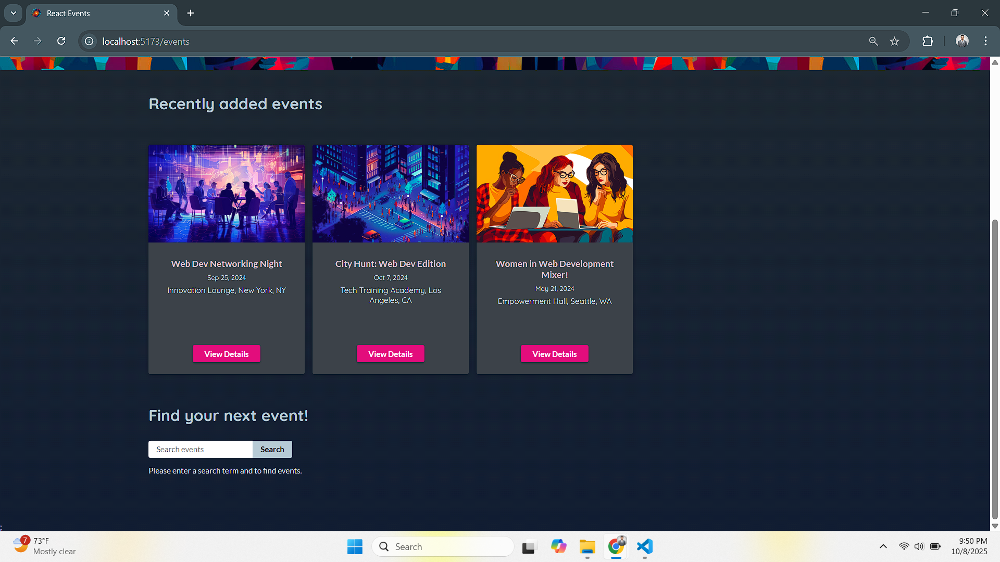
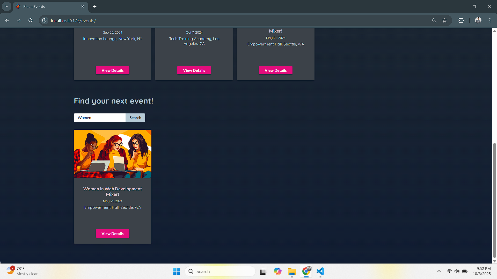

# React Events

A practice project using **React 19** (frontend) + **Node.js** (backend) to build a simple events web application.  
The goal is to explore advanced data-fetching & mutation patterns (especially with **TanStack Query**), and to try newer **React Router Dom** features (like loaders, actions, etc.).

---

## Table of Contents
- [Screenshots](#Screenshots)
- [Features](#features)
- [Tech Stack](#tech-stack)
- [Project Structure](#project-structure)
- [Getting Started](#getting-started)
- [Usage](#usage)
- [Examples of Advanced Concepts](#examples-of-advanced-concepts)
- [Future Improvements](#future-improvements)
- [Contribution](#contribution)
- [Contact](#contact)

---
## Screenshots

### Homepage


---

### Recent Events


---

### Search


## Features

- Create, read, update, and delete (CRUD) operations for events  
- Fetching and mutating remote data using **TanStack Query**  
- Use of React’s latest features:
  - Loaders & Action creators  
  - React hooks  
- Backend API built with **Node.js** and **Express** to support events endpoints

---

## Tech Stack

| Layer       | Technologies Used |
|--------------|------------------|
| Frontend     | React 19, React Router DOM 6.15, React hooks, React loader/action patterns, TanStack Query 5.86 |
| Backend      | Node.js, Express, RESTful API endpoints |
| Data Storage | JSON file-based storage for events |

---

## Getting Started

Follow these steps to set up and run the project locally.

### 1. Clone the repository

```bash
git clone https://github.com/AqibNiazi/react-events.git
cd react-events
```
### 2. Setup the backend

```bash
cd backend
npm install   # or yarn install
# Set environment variables if needed (e.g. PORT, DB_URL, etc.)
npm start     # or node server.js / nodemon
```
### 3. Setup the frontend
```bash
cd ../frontend
npm install
npm run dev   # launches the React app in development mode
```

Here’s your **README.md** with all formatting issues fixed, consistent markdown syntax, and properly aligned code blocks — ready for GitHub:

---

````markdown
# React Events

A practice project using **React 19** (frontend) + **Node.js** (backend) to build a simple events web application.  
The goal is to explore advanced data-fetching & mutation patterns (especially with **TanStack Query**), and to try newer **React Router Dom** features (like loaders, actions, etc.).

---

## Table of Contents

- [Features](#features)
- [Tech Stack](#tech-stack)
- [Project Structure](#project-structure)
- [Getting Started](#getting-started)
- [Usage](#usage)
- [Examples of Advanced Concepts](#examples-of-advanced-concepts)
- [Future Improvements](#future-improvements)
- [Contribution](#contribution)
- [Contact](#contact)

---

## Features

- Create, read, update, and delete (CRUD) operations for events  
- Fetching and mutating remote data using **TanStack Query**  
- Use of React’s latest features:
  - Loaders & Action creators  
  - React hooks  
- Backend API built with **Node.js** and **Express** to support events endpoints

---

## Tech Stack

| Layer       | Technologies Used |
|--------------|------------------|
| Frontend     | React 19, React Router DOM 6.15, React hooks, React loader/action patterns, TanStack Query 5.86 |
| Backend      | Node.js, Express, RESTful API endpoints |
| Data Storage | JSON file-based storage for events |

---

## Getting Started

Follow these steps to set up and run the project locally.

### 1. Clone the repository

```bash
git clone https://github.com/AqibNiazi/react-events.git
cd react-events
````

### 2. Setup the backend

```bash
cd backend
npm install   # or yarn install

# Set environment variables if needed (e.g. PORT, DB_URL, etc.)
npm start     # or node server.js / nodemon
```

### 3. Setup the frontend

```bash
cd ../frontend
npm install
npm run dev   # launches the React app in development mode
```

### 4. Open in browser

Usually available at:
👉 `http://localhost:3000`

Verify that you can:

* Fetch events from the backend
* Add/edit/delete events

---

## Usage

* View list of events
* Add new events (title, image, details, date, etc.)
* Edit existing events
* Delete events
* Basic form validation
* Handle error and loading states using **TanStack Query** (e.g. `isLoading`, `isError`)

---

## Examples of Advanced Concepts

### 1. TanStack Query

* Use of query keys
* Cache invalidation
* Optimistic updates
* Background refetching
* Query state management

### 2. React Loaders & Actions

* Using loaders to fetch data before rendering
* Using action creators for mutations (form submissions, deletes, etc.)

### 3. Error & Loading UI

* Custom loading spinners
* User-friendly error messages
* Graceful handling of edge cases (e.g. no events, backend unavailable)

---

## Future Improvements

* Add **user authentication** for secure event management
* Add **pagination** or **infinite scrolling** for large datasets
* Implement **search and filter** functionality
* Store events in a real database (MongoDB, PostgreSQL, etc.)

---

## Contribution

Since this is mainly a personal/practice project, contributions aren’t required — but feel free to:

1. Fork the repository
2. Make your changes
3. Open a Pull Request

If you contribute, please:

* Follow the existing code style
* Add clear comments (especially around advanced hooks or loader logic)

---

## Contact

**Author:** Muhammad Aqib Javed

* GitHub: [AqibNiazi](https://github.com/AqibNiazi)
* Email: [aqibjaved5201@gmail.com](mailto:aqibjaved5201@gmail.com)

```


